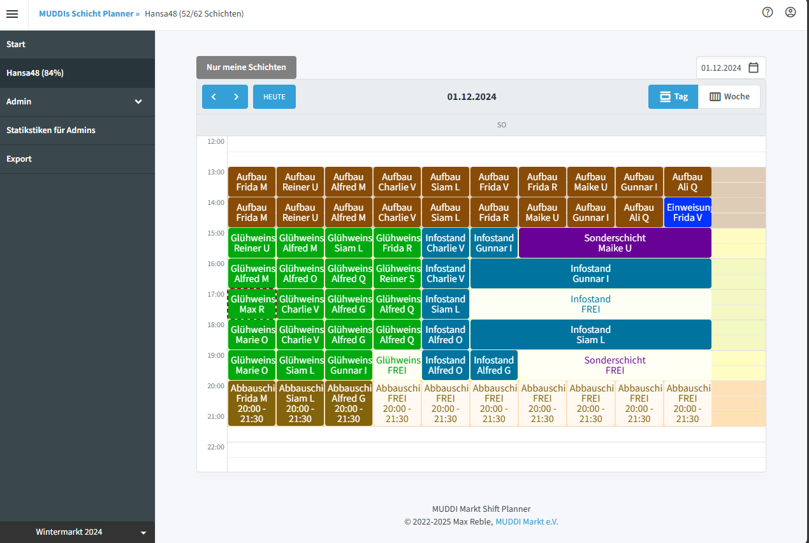

# Muddi's Shift Planner



## Domain Concepts

The shift planner organizes work shifts using the following hierarchy:

### Season
A **Season** represents a time-bounded event period (e.g., "Summer Festival 2024"). All configuration and shift data belongs to exactly one season. Seasons have a name, start date, and end date.

### Shift Locations
**Locations** represent physical places where shifts occur (e.g., "Main Bar", "Entry Gate", "Backstage"). Each location has a type (e.g., "Bar", "Security Post").

### Shift Types
**Shift Types** define the categories of work that can be assigned (e.g., "Bar Staff", "Security", "Setup Crew"). Each type has:
- **Name** - Display name
- **Color** - For visual identification in the UI
- **StartingTimeShift** - Time offset for when this type of shift typically starts
- **OnlyAssignableByAdmin** - Whether only admins can assign this type
- **Description** - Optional details about the role

### Shift Frameworks
**Frameworks** are templates that define a shift pattern. They specify:
- **Name** - e.g., "Morning Bar Shift", "Night Security"
- **SecondsPerShift** - Duration of each shift slot
- **ShiftTypeCounts** - How many workers of each ShiftType are needed (e.g., "3x Bar Staff, 2x Security")

### Containers
**Containers** are the concrete, scheduled instances that combine a Framework with a Location at a specific time. For example:
- Location: "Main Bar"
- Framework: "Evening Bar Shift" (4 hours, needs 3 Bar Staff)
- Start: June 15, 2024 at 18:00
- TotalShifts: 3 (meaning 3 consecutive 4-hour blocks)

This creates the actual shift slots that employees can sign up for.

### Shifts
**Shifts** are individual assignments of an employee to a specific time slot within a Container.

```
Season
├── Shift Types (what kind of work)
├── Frameworks (shift templates with duration & staffing needs)
├── Locations (where)
│   └── Containers (when + which framework)
│       └── Shifts (who is assigned)
```

## How to contribute

First install dotnet 10 sdk and docker, then:

```shell
cd Docker/muddi-shiftplanner-compose/
docker compose up
```

this will start up the services you need for development.

### Keycloak

In [keycloak admin console](http://localhost:28080/admin/) login with user `admin` and pass `admin`, click on master realm and
on `Add realm`. Then `Select file` and select `./Docker/muddi-shiftplanner-compose/config/keycloak/realm-export.json`.

Then create a new user called `api-admin@muddimarkt.org` in the Muddi Realm, make sure you set 'E-Mail verified' and then set the Credentials (password) as `admin`. Also give the user under Role Mappings all roles for the shift-planner Client and also in client role `realm-management` the role `view-users`

In Role Mappings you can also set Client Roles for shift-planner (e.g. admin, editor, super-admin or viewer)
### Dotnet secrets

Also you have to init [dotnet secrets](https://learn.microsoft.com/en-us/aspnet/core/security/app-secrets?view=aspnetcore-7.0&tabs=windows)
if you want to use the alerting service:

##### secrets.json:

```json
{
  "Telegram": {
    "ApiToken": "YOUR-API-TOKEN"
  }
}
```

### Building Images

To build just run the .sh files in ./Docker. You may have to change the tag.

### Running

In your IDE just run those 3 projects:

* Muddi.ShiftPlanner.Client
* Muddi.ShiftPlanner.Server.Api
* Muddi.ShiftPlanner.Services.Alerting
